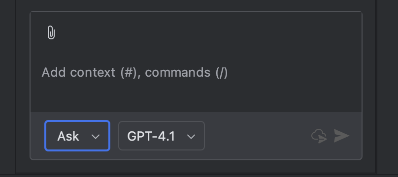

# 3. IntelliJ 에서 진행하기

## ⏰ 소요 시간

**10분**

***

## 🔧 Coding Tool 설치

### Step 1: IntelliJ IDEA 설치

1. [IntelliJ IDEA 다운로드](https://www.jetbrains.com/idea/download/)
2. **Community Edition (무료)** 또는 **Ultimate Edition** 선택
3. 다운로드한 설치 파일 실행
4. 설치 마법사 따라 진행 (기본 설정 권장)
5. 설치 완료 후 IntelliJ IDEA 실행

### Step 2: GitHub Copilot 플러그인 설치

1. **IntelliJ IDEA 열기**
2. **GitHub Copilot 검색 및 설치**
   1.

       <figure><figcaption></figcaption></figure>
3. IDE 다시 시작
   1.

       <figure><figcaption></figcaption></figure>

### Step 3: 새 프로젝트 생성

1. 실습을 진행할 프로젝트를 생성합니다.
   1.

       <figure><figcaption></figcaption></figure>
2. 왼쪽 메뉴에서 '빈 프로젝트' 를 선택하고 '이름'과 '위치'를 지정하고 생성 버튼을 누릅니다.
   1.

       <figure><figcaption></figcaption></figure>

### Step 4: 로그인 및 권한 승인

1. 하단 오른쪽에 있는 아이콘을 누른 뒤 " Login to GitHub" 버튼을 클릭합니다.
   1.

       <figure><figcaption></figcaption></figure>
2. Device Code 를 복사하고 \[Copy and Open] 버튼을 클릭합니다.
   1.

       <figure><figcaption></figcaption></figure>
3.  로그인한 계정을 선택해서 \[Continue] 버튼을 누릅니다.

    <figure><figcaption></figcaption></figure>
4. Device Activation 코드를 붙여넣고 Continue 를 누릅니다.
   1.

       <figure><figcaption></figcaption></figure>
5. 이어서 나온 화면에서 Authorize 를 눌러서 로그인을 완료합니다.

### Step 5: Copilot 활성화 확인하기

1. ntelliJ 오른쪽 하단 상태 바에서 Copilot 아이콘을 확인합니다.
   1.

       
<figure><figcaption></figcaption></figure>

### Step 6: Copilot Chat 열기

1. 활성화된 버튼을 누르고 \[Open Chat] 버튼을 누릅니다.
   1.

       <figure><figcaption></figcaption></figure>
2. "안녕! 코파일럿!' 을 입력하고 응답을 확인합니다.
   1.

       <figure><figcaption></figcaption></figure>

***

## 📚 다음 세션 미리보기

**4. GitHub Copilot 첫 사용하기**에서는:

* Copilot Chat으로 첫 대화 시작
* 간단한 표와 문서 생성
* 프롬프트 작성 기본기 익히기

**소요 시간:** 10분\
**준비물:** 없음 (지금 완료한 환경으로 바로 시작!)
