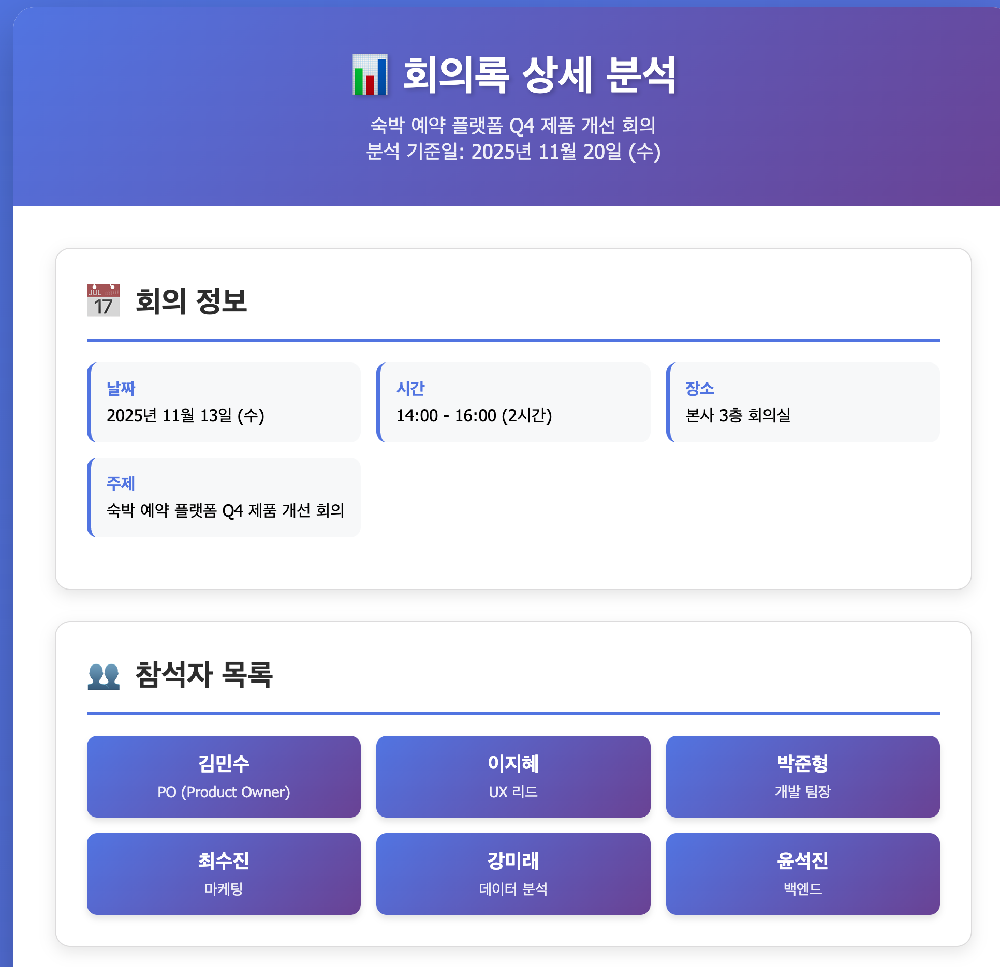
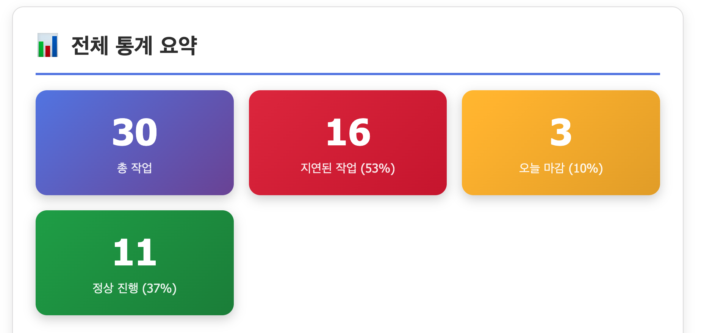
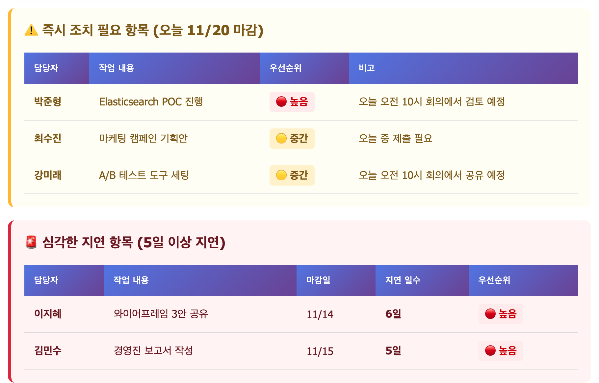

# 2. 회의록 자동 정리

## ⏰ 소요 시간

**30분**

***

## 📖 시나리오

주간 제품 회의를 마쳤습니다. 30분간 논의한 내용을 메모했지만 정리되지 않은 상태입니다. 팀원들에게 공유할 회의록을 만들어야 합니다. 특히 **누가, 언제까지, 무엇을** 해야 하는지 명확히 정리해야 합니다.

**현재 문제:**

* ❌ 회의록 정리에 30분 이상 소요
* ❌ Action Item을 빠뜨리는 경우 발생
* ❌ 담당자와 마감일이 불명확

**Copilot으로 해결:**

* ✅ 5분 내 정리 완료
* ✅ 모든 Action Item 자동 추출
* ✅ 명확한 표 형식으로 정리

***

## 📋 실습 재료: 실제 회의록

**샘플 파일 사용 (권장)** `data/sample_meeting_notes.txt` 파일을 열어서 내용을 확인하세요.

**또는 아래 내용 복사**

<details>

<summary>회의록 내용 보기 (클릭하여 펼치기)</summary>

```
2025년 11월 13일 숙박 예약 플랫폼 Q4 제품 개선 회의

참석자: 김민수(PO), 이지혜(UX 리드), 박준형(개발 팀장), 최수진(마케팅), 강미래(데이터 분석), 윤석진(백엔드)

회의 시간: 14:00 - 16:00 (2시간)
장소: 본사 3층 회의실

=== 안건 1: 검색 기능 개선 ===

김민수: 지난 분기 데이터를 보니 검색 이탈률이 35%에 달합니다. 사용자들이 지역 검색할 때 자동완성이 너무 느리다는 VOC가 월 200건 이상 접수되고 있습니다.

강미래: 데이터 분석 결과, 자동완성 응답 시간이 평균 3.2초입니다. 업계 표준인 0.5초에 비해 6배 이상 느립니다. 특히 모바일에서는 4.1초까지 늘어나고 있습니다.

박준형: 현재 검색 API가 레거시 시스템을 사용 중입니다. Elasticsearch로 전환하면 0.3초 이내로 개선 가능합니다. 예상 작업 기간은 3주 정도입니다.

이지혜: 사용자 테스트 결과, 리뷰 섹션이 너무 아래에 있어서 80%의 사용자가 스크롤을 3번 이상 내려야 찾을 수 있었습니다. 그리고 이미지 로딩 속도도 개선이 필요합니다 - 평균 2.8초 소요됩니다.

윤석진: 이미지 최적화는 CDN 설정과 WebP 포맷 전환으로 개선 가능합니다. 예상 로딩 시간은 0.8초로 단축됩니다. 다음 주까지 작업하겠습니다.

최수진: 리뷰 섹션 위치 변경은 전환율에 큰 영향을 줄 것 같습니다. 경쟁사 A는 리뷰가 상단에 있어서 예약 전환율이 18% 더 높습니다. 디자인 시안만 나오면 이틀이면 구현 가능할 것 같습니다.

이지혜: 내일 중으로 와이어프레임 3가지 안을 공유하겠습니다. 필터 UI도 개선이 필요합니다 - 특히 모바일에서 필터 버튼 탭 성공률이 67%밖에 안 됩니다.

=== 안건 2: 모바일 UX 개선 ===

이지혜: 모바일 사용자가 전체의 73%인데 모바일 만족도가 3.2점으로 낮습니다. 주요 불만은 1) 필터 버튼이 작음, 2) 가격 정보가 불명확, 3) 예약 버튼을 찾기 어려움입니다.

강미래: 히트맵 분석 결과, 사용자들이 필터 버튼을 찾기까지 평균 8.3초가 걸립니다. 경쟁사는 2.1초입니다.

최수진: 모바일 전환율이 데스크톱 대비 40% 낮습니다. 이달 말까지 개선하면 월 매출이 약 8천만원 증가할 것으로 예상됩니다.

=== 안건 3: 가격 알림 기능 추가 ===

김민수: 시장 조사 결과, 가격 알림 기능이 있는 경쟁사들의 재방문율이 25% 더 높습니다. 우리도 추가해야 할 것 같습니다.

박준형: Push 알림 시스템 구축이 필요합니다. Firebase 기반으로 2주면 가능합니다. 이메일 알림은 1주일이면 됩니다.

최수진: 가격 알림 기능을 마케팅 포인트로 활용할 수 있습니다. "원하는 가격에 알림 받기" 캠페인을 기획 중입니다.

=== 결정 사항 ===

우선순위 1 (이번 주):
- 리뷰 섹션을 상단으로 이동 (담당: 이지혜, 최수진)
- 모바일 필터 버튼 크기 2배 확대 (담당: 이지혜)
- 예약 버튼 색상 변경 (파란색 → 주황색) (담당: 이지혜)

우선순위 2 (다음 주):
- 이미지 로딩 속도 개선 - CDN 설정 (담당: 윤석진)
- 이미지 WebP 포맷 전환 (담당: 윤석진)
- A/B 테스트 준비 (담당: 강미래)

우선순위 3 (2주 후):
- 검색 API Elasticsearch 전환 (담당: 박준형, 윤석진)
- 필터 UI 전면 개편 (담당: 이지혜, 최수진)

우선순위 4 (다음 스프린트):
- 가격 알림 기능 개발 (담당: 박준형)
- Push 알림 시스템 구축 (담당: 박준형)

=== 액션 아이템 ===

김민수:
- 경영진 보고서 작성 (11/15)
- 예산 확보 회의 (11/16)

이지혜:
- 와이어프레임 3안 공유 (11/14)
- 사용자 테스트 5명 모집 (11/17)
- 프로토타입 제작 (11/18)

박준형:
- Elasticsearch POC 진행 (11/20)
- 기술 스펙 문서 작성 (11/17)
- 인프라 비용 산정 (11/18)

최수진:
- 경쟁사 분석 보고서 (11/16)
- 마케팅 캠페인 기획안 (11/20)
- A/B 테스트 시나리오 작성 (11/19)

강미래:
- 주간 데이터 리포트 (매주 금요일)
- A/B 테스트 도구 세팅 (11/20)
- 전환율 대시보드 업데이트 (11/17)

윤석진:
- CDN 설정 완료 (11/18)
- 이미지 최적화 스크립트 작성 (11/19)
- 성능 개선 전후 비교 리포트 (11/22)

=== 리스크 및 이슈 ===

- Elasticsearch 전환 시 기존 데이터 마이그레이션 리스크
- 리뷰 섹션 이동 시 SEO 영향 검토 필요
- 모바일 필터 UI 개선 시 iOS/Android 별도 테스트 필요
- 가격 알림 기능 개인정보 처리 방침 업데이트 필요

=== 다음 회의 ===

일시: 11월 20일 (수) 오전 10:00
안건: 
1. 우선순위 1 작업 결과 리뷰
2. A/B 테스트 중간 결과 공유
3. Elasticsearch POC 결과 검토
4. 다음 스프린트 계획

참석자: 전원 참석
준비사항: 각자 진행 상황 10분 발표 자료

```

</details>

***

## 📝 실습 1: Action Item 자동 추출하기

Copilot Agent에게 자연어로 요청하면 자동으로 처리됩니다.

### Step 1: Copilot Chat 열기

Copilot Chat 창을 열고 아래와 같이 요청해보세요.

### Step 2: Copilot에게 명령하기

Chat 창에 다음과 같이 요청하세요:

```
data/sample_meeting_notes.txt 파일을 읽어서 
다음 정보를 추출해서 보여줘:

1. 회의 날짜와 주제
2. 참석자 목록 (이름과 역할)
3. Action Items (작업 내용, 담당자, 마감일)
4. 주요 결정 사항

결과는 Markdown 표 형식으로 보여줘.
```

### Step 3: 수정 요청 및 파일 저장

만족스럽지 않으면 자연어로 다시 요청:

```
마감일을 더 구체적으로 추출해줘
우선순위를 높음/중간/낮음으로 자동 판단해줘
담당자별로 작업을 그룹화해서 보여줘
```

**파일 저장이 필요한 경우**:

```
위 결과를 meeting_summary.md 파일로 저장해줘
```

Copilot이 자동으로 파일을 생성하고 저장합니다.

***

## 🎯 예상 결과물

<details>

<summary>완성된 결과물 보기 (클릭하여 펼치기)</summary>

**회의록 상세 분석 (2025년 11월 20일 기준)**

**📅 1. 회의 정보**

| 항목     | 내용                    |
| ------ | --------------------- |
| **날짜** | 2025년 11월 13일 (수)     |
| **주제** | 숙박 예약 플랫폼 Q4 제품 개선 회의 |
| **시간** | 14:00 - 16:00 (2시간)   |
| **장소** | 본사 3층 회의실             |

**👥 2. 참석자 목록**

| 이름  | 역할                 |
| --- | ------------------ |
| 김민수 | PO (Product Owner) |
| 이지혜 | UX 리드              |
| 박준형 | 개발 팀장              |
| 최수진 | 마케팅                |
| 강미래 | 데이터 분석             |
| 윤석진 | 백엔드                |

***

**📋 3. 담당자별 작업 그룹화 (우선순위 포함)**

**👤 김민수 (PO)**

| 작업 내용      | 마감일       | 남은 기간          | 우선순위      | 상태    |
| ---------- | --------- | -------------- | --------- | ----- |
| 경영진 보고서 작성 | 11/15 (금) | **기한 경과 (5일)** | 🔴 **높음** | ⚠️ 지연 |
| 예산 확보 회의   | 11/16 (토) | **기한 경과 (4일)** | 🔴 **높음** | ⚠️ 지연 |

**총 작업**: 2개 | **지연된 작업**: 2개

***

**👤 이지혜 (UX 리드)**

| 작업 내용                 | 마감일                | 남은 기간          | 우선순위      | 상태    |
| --------------------- | ------------------ | -------------- | --------- | ----- |
| 와이어프레임 3안 공유          | 11/14 (목)          | **기한 경과 (6일)** | 🔴 **높음** | ⚠️ 지연 |
| 사용자 테스트 5명 모집         | 11/17 (일)          | **기한 경과 (3일)** | 🟡 **중간** | ⚠️ 지연 |
| 프로토타입 제작              | 11/18 (월)          | **기한 경과 (2일)** | 🟡 **중간** | ⚠️ 지연 |
| 리뷰 섹션을 상단으로 이동        | 이번 주 (11/13-11/19) | **기한 경과 (1일)** | 🔴 **높음** | ⚠️ 지연 |
| 모바일 필터 버튼 크기 2배 확대    | 이번 주 (11/13-11/19) | **기한 경과 (1일)** | 🔴 **높음** | ⚠️ 지연 |
| 예약 버튼 색상 변경 (파란색→주황색) | 이번 주 (11/13-11/19) | **기한 경과 (1일)** | 🔴 **높음** | ⚠️ 지연 |
| 필터 UI 전면 개편           | 2주 후 (11/27 예상)    | 7일 남음          | 🟢 **낮음** | ✅ 정상  |

**총 작업**: 7개 | **지연된 작업**: 6개 | **진행 중**: 1개

***

**👤 박준형 (개발 팀장)**

| 작업 내용                   | 마감일                | 남은 기간          | 우선순위      | 상태    |
| ----------------------- | ------------------ | -------------- | --------- | ----- |
| 기술 스펙 문서 작성             | 11/17 (일)          | **기한 경과 (3일)** | 🟡 **중간** | ⚠️ 지연 |
| 인프라 비용 산정               | 11/18 (월)          | **기한 경과 (2일)** | 🟡 **중간** | ⚠️ 지연 |
| Elasticsearch POC 진행    | 11/20 (수)          | **오늘 마감**      | 🔴 **높음** | ⏰ 마감일 |
| 검색 API Elasticsearch 전환 | 2주 후 (11/27 예상)    | 7일 남음          | 🟡 **중간** | ✅ 정상  |
| 가격 알림 기능 개발             | 다음 스프린트 (12월 초 예상) | 약 2주 남음        | 🟢 **낮음** | ✅ 정상  |
| Push 알림 시스템 구축          | 다음 스프린트 (12월 초 예상) | 약 2주 남음        | 🟢 **낮음** | ✅ 정상  |

**총 작업**: 6개 | **지연된 작업**: 2개 | **오늘 마감**: 1개 | **진행 중**: 3개

***

**👤 최수진 (마케팅)**

| 작업 내용               | 마감일                | 남은 기간          | 우선순위      | 상태    |
| ------------------- | ------------------ | -------------- | --------- | ----- |
| 경쟁사 분석 보고서          | 11/16 (토)          | **기한 경과 (4일)** | 🟡 **중간** | ⚠️ 지연 |
| A/B 테스트 시나리오 작성     | 11/19 (화)          | **기한 경과 (1일)** | 🟡 **중간** | ⚠️ 지연 |
| 마케팅 캠페인 기획안         | 11/20 (수)          | **오늘 마감**      | 🟡 **중간** | ⏰ 마감일 |
| 리뷰 섹션을 상단으로 이동 (공동) | 이번 주 (11/13-11/19) | **기한 경과 (1일)** | 🔴 **높음** | ⚠️ 지연 |
| 필터 UI 전면 개편 (공동)    | 2주 후 (11/27 예상)    | 7일 남음          | 🟢 **낮음** | ✅ 정상  |

**총 작업**: 5개 | **지연된 작업**: 3개 | **오늘 마감**: 1개 | **진행 중**: 1개

***

**👤 강미래 (데이터 분석)**

| 작업 내용         | 마감일                   | 남은 기간          | 우선순위      | 상태    |
| ------------- | --------------------- | -------------- | --------- | ----- |
| 전환율 대시보드 업데이트 | 11/17 (일)             | **기한 경과 (3일)** | 🟡 **중간** | ⚠️ 지연 |
| 주간 데이터 리포트    | 매주 금요일 (11/14, 11/21) | 내일 (11/21)     | 🔴 **높음** | ✅ 정상  |
| A/B 테스트 도구 세팅 | 11/20 (수)             | **오늘 마감**      | 🟡 **중간** | ⏰ 마감일 |
| A/B 테스트 준비    | 다음 주 (11/20-11/26)    | 진행 중           | 🟡 **중간** | ✅ 정상  |

**총 작업**: 4개 | **지연된 작업**: 1개 | **오늘 마감**: 1개 | **진행 중**: 2개

***

**👤 윤석진 (백엔드)**

| 작업 내용                        | 마감일                | 남은 기간          | 우선순위      | 상태    |
| ---------------------------- | ------------------ | -------------- | --------- | ----- |
| CDN 설정 완료                    | 11/18 (월)          | **기한 경과 (2일)** | 🔴 **높음** | ⚠️ 지연 |
| 이미지 최적화 스크립트 작성              | 11/19 (화)          | **기한 경과 (1일)** | 🔴 **높음** | ⚠️ 지연 |
| 성능 개선 전후 비교 리포트              | 11/22 (금)          | 2일 남음          | 🟡 **중간** | ✅ 정상  |
| 이미지 로딩 속도 개선 - CDN 설정        | 다음 주 (11/20-11/26) | 진행 중           | 🔴 **높음** | ✅ 정상  |
| 이미지 WebP 포맷 전환               | 다음 주 (11/20-11/26) | 진행 중           | 🔴 **높음** | ✅ 정상  |
| 검색 API Elasticsearch 전환 (공동) | 2주 후 (11/27 예상)    | 7일 남음          | 🟡 **중간** | ✅ 정상  |

**총 작업**: 6개 | **지연된 작업**: 2개 | **진행 중**: 4개

***

**📊 4. 전체 통계 요약**

**우선순위별 작업 분포**

| 우선순위      | 작업 수    | 비율       |
| --------- | ------- | -------- |
| 🔴 **높음** | 13개     | 43%      |
| 🟡 **중간** | 13개     | 43%      |
| 🟢 **낮음** | 4개      | 14%      |
| **합계**    | **30개** | **100%** |

**상태별 작업 분포**

| 상태          | 작업 수    | 비율       |
| ----------- | ------- | -------- |
| ⚠️ **지연**   | 16개     | 53%      |
| ⏰ **오늘 마감** | 3개      | 10%      |
| ✅ **정상 진행** | 11개     | 37%      |
| **합계**      | **30개** | **100%** |

**담당자별 작업 부하**

| 담당자          | 총 작업 | 지연 | 오늘 마감 | 정상 | 부하도   |
| ------------ | ---- | -- | ----- | -- | ----- |
| 이지혜 (UX 리드)  | 7개   | 6  | 0     | 1  | 🔴 높음 |
| 박준형 (개발 팀장)  | 6개   | 2  | 1     | 3  | 🟡 중간 |
| 윤석진 (백엔드)    | 6개   | 2  | 0     | 4  | 🟡 중간 |
| 최수진 (마케팅)    | 5개   | 3  | 1     | 1  | 🟡 중간 |
| 강미래 (데이터 분석) | 4개   | 1  | 1     | 2  | 🟢 보통 |
| 김민수 (PO)     | 2개   | 2  | 0     | 0  | 🔴 높음 |

***

**⚠️ 5. 즉시 조치 필요 항목 (오늘 11/20 마감)**

| 담당자 | 작업 내용                | 우선순위  | 비고                   |
| --- | -------------------- | ----- | -------------------- |
| 박준형 | Elasticsearch POC 진행 | 🔴 높음 | 오늘 오전 10시 회의에서 검토 예정 |
| 최수진 | 마케팅 캠페인 기획안          | 🟡 중간 | 오늘 중 제출 필요           |
| 강미래 | A/B 테스트 도구 세팅        | 🟡 중간 | 오늘 오전 10시 회의에서 공유 예정 |

***

**🚨 6. 심각한 지연 항목 (5일 이상 지연)**

| 담당자 | 작업 내용        | 마감일   | 지연 일수 | 우선순위  |
| --- | ------------ | ----- | ----- | ----- |
| 이지혜 | 와이어프레임 3안 공유 | 11/14 | 6일    | 🔴 높음 |
| 김민수 | 경영진 보고서 작성   | 11/15 | 5일    | 🔴 높음 |

***

**📌 7. 다음 회의 정보**

| 항목       | 내용                                                                                              |
| -------- | ----------------------------------------------------------------------------------------------- |
| **일시**   | 11월 20일 (수) 오전 10:00 (**오늘!**)                                                                  |
| **안건**   | <p>1. 우선순위 1 작업 결과 리뷰<br>2. A/B 테스트 중간 결과 공유<br>3. Elasticsearch POC 결과 검토<br>4. 다음 스프린트 계획</p> |
| **참석자**  | 전원 참석                                                                                           |
| **준비사항** | 각자 진행 상황 10분 발표 자료                                                                              |

***

**💡 우선순위 판단 기준**

* 🔴 **높음**:
  * 이번 주 완료 예정 작업
  * 경영진 보고/예산 관련
  * 성능/UX 개선 즉시 적용 항목
  * 주간 반복 업무
* 🟡 **중간**:
  * 다음 주 완료 예정 작업
  * 분석/기획 문서 작성
  * 2주 후 완료 예정 개발 작업
* 🟢 **낮음**:
  * 다음 스프린트 작업
  * 장기 프로젝트
  * 의존성이 있는 후속 작업

</details>

***

## 📊 실습 2: 고급 분석 및 시각화

이번에는 더 멋진 결과를 만들어봅시다! 담당자별 작업 현황을 시각화하고 HTML 리포트 만들기

### Step1: Copilot에게 명령하기

```
위 결과를 보기 좋은 HTML 리포트로 만들어서 
meeting_action_items.html 파일로 저장해줘.

다음 내용 포함:
- 회의 정보 (날짜, 참석자)
- 담당자별 작업 목록 표
- 우선순위 파이 차트
- 우선순위별 색상 구분 (높음=빨강, 중간=주황, 낮음=초록)
- 마감일 타임라인
- 스타일링 (그라데이션 배경, 카드 디자인)
```

## 🎯 예상 결과물

<details>

<summary>완성된 결과물 보기 (클릭하여 펼치기)</summary>

<figure><figcaption></figcaption></figure>

<figure><figcaption></figcaption></figure>

<figure><figcaption></figcaption></figure>

</details>

***

## 📚 다음 세션 미리보기

**📝 문서 자동화 > 3. 회의록 작성 앱 만들기**에서는:

* 재사용 가능한 회의록 템플릿 앱(`meeting_template_app.html`) 생성
* 회의 기본 정보, 논의 사항, Action Item 섹션을 자동 배치
* 입력 완료 후 버튼 한 번으로 txt 파일로 내보내기
* 슬랙/이메일 공유용 스크린샷 예시 확인

**소요 시간:** 30분\
**준비물:** 최근 회의 메모 또는 샘플 데이터
