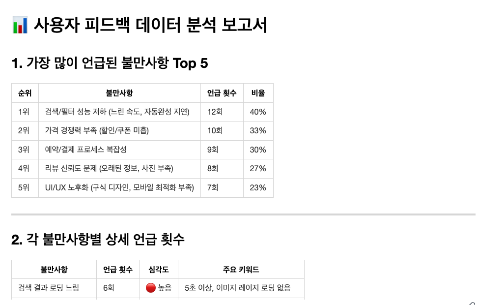

# 2. 사용자 피드백 분석

## ⏰ 소요 시간

**25분**

***

## 📖 시나리오

CX 팀이 15명의 사용자 인터뷰 메모를 한꺼번에 전달했습니다. 내일 오전 운영회의에서 "불만사항 Top 5"와 "페르소나별 니즈"를 보고해야 하는데, 메모는 모두 자유 형식이라 복붙·분류·집계를 직접 하면 밤을 새울 상황입니다. Copilot을 사용해 비정형 텍스트를 구조화하고, 다음 세션(데이터 기반 의사결정)에서 사용할 분석 테이블을 뽑아냅니다.

**현재 문제:**

* ❌ 사용자 발화가 길고 제각각이라 카테고리 분류와 횟수 집계가 힘듦
* ❌ 연령/직업 등 메타 정보를 기준으로 페르소나 묶음 만들기가 번거로움
* ❌ 우선순위, 감정, 심각도를 숫자로 표현하지 못해 다음 단계 의사결정에 활용이 어려움

**Copilot으로 해결:**

* ✅ `data/user_feedback_data.txt`를 읽어 카테고리·키워드·언급 횟수를 자동으로 정리
* ✅ 연령대/직업을 기준으로 페르소나 그룹을 만들고, 각 그룹의 핵심 니즈를 요약
* ✅ 감정/심각도/우선순위를 자동 계산해 `user_feedback_table.md`에 담아 다음 세션에서 재활용

***

## 📋 실습 재료: 사용자 피드백 데이터

### 방법 1: 샘플 파일 사용 (권장)

`data/user_feedback_data.txt` 파일을 열어서 내용을 확인하세요.

### 방법 2: 아래 내용 복사

<details>

<summary>피드백 데이터 보기 (클릭하여 펼치기)</summary>

```
=== 숙박 검색 기능 사용자 인터뷰 결과 ===

[사용자 1 - 김지현, 27세, 여성, 직장인]
"지역 검색할 때 자동완성이 너무 느려요. 세 글자 입력하면 3초 정도 기다려야 해서 답답해요. 
야놀자는 바로바로 뜨는데 여기는 왜 이렇게 느린지 모르겠어요."

[사용자 2 - 박민수, 34세, 남성, 자영업]
"필터 기능이 불편해요. 특히 모바일에서 필터 버튼 위치가 애매해서 찾기 힘들어요. 
가격대 설정하려면 스크롤을 한참 내려야 하고, 버튼도 작아서 터치하기 어려워요."

[사용자 3 - 이수진, 29세, 여성, 프리랜서]
"검색 결과가 너무 많아요. 100개 넘게 뜨는데 어떤 기준으로 정렬된 건지 모르겠어요. 
인기순? 가격순? 명확하지 않아서 선택하기 어려워요. 그리고 사진 로딩도 느려요."

[사용자 4 - 최준혁, 41세, 남성, 회사원]
"지도 뷰가 있으면 좋겠어요. 숙소 위치가 실제로 어디인지 확인하기 어려워요. 
지도에서 한눈에 보고 싶은데, 일일이 클릭해서 확인해야 하니 불편합니다."

[사용자 5 - 정다은, 25세, 여성, 대학생]
"가격이 너무 비싸요. 학생 할인 같은 게 있으면 좋겠는데 없더라고요. 
경쟁사는 첫 예약 할인, 학생 할인 등 다양한 프로모션이 있어요."

[사용자 6 - 한승우, 38세, 남성, 프리랜서]
"리뷰가 신뢰가 안 가요. 별점은 높은데 실제로 가보면 별로인 경우가 많아요. 
사진 리뷰가 많으면 좋겠고, 최근 리뷰를 먼저 보여줬으면 좋겠어요."

[사용자 7 - 강미래, 31세, 여성, PO]
"검색 조건을 저장하는 기능이 있으면 좋겠어요. 맨날 같은 지역, 같은 날짜로 검색하는데 
매번 다시 입력하는 게 번거로워요. 즐겨찾기 같은 기능이 필요해요."

[사용자 8 - 윤석진, 45세, 남성, 임원]
"비즈니스 여행으로 자주 쓰는데, 영수증 발급이 불편해요. 
세금계산서 자동 발급 옵션이 있었으면 좋겠어요."

[사용자 9 - 조아름, 26세, 여성, 마케터]
"모바일 앱 디자인이 구식이에요. UI가 2015년 스타일 같아요. 
좀 더 세련되고 깔끔한 디자인으로 개선됐으면 좋겠어요."

[사용자 10 - 임준영, 33세, 남성, 개발자]
"체크인/체크아웃 날짜 선택이 불편해요. 달력 인터페이스가 직관적이지 않고, 
날짜 범위 선택할 때 헷갈려요. 경쟁사처럼 시각적으로 표시해주면 좋겠어요."

[사용자 11 - 서연주, 28세, 여성, 디자이너]
"사진이 실제와 다른 경우가 많아요. 호텔 측에서 올린 사진만 있고 실제 사용자 사진이 별로 없어요.
실사용자 사진을 더 많이 보여줬으면 좋겠어요."

[사용자 12 - 김태윤, 36세, 남성, 회사원]
"패밀리룸 같은 특정 옵션으로 검색하기 어려워요. 
필터에 방 타입 옵션이 부족하고, 아이 동반 가능 여부도 명확하지 않아요."

[사용자 13 - 박소희, 42세, 여성, 주부]
"결제 옵션이 다양하지 않아요. 무이자 할부나 포인트 사용 같은 걸 기대했는데 없더라고요.
다른 앱은 다 있는데 여기만 없어서 불편해요."

[사용자 14 - 이재훈, 30세, 남성, 스타트업 대표]
"검색 속도가 느려요. 특히 필터 여러 개 적용하면 결과 나오는 데 5초 이상 걸려요.
빨리빨리 보고 결정하고 싶은데 답답해요."

[사용자 15 - 최은지, 27세, 여성, 공무원]
"취소 정책이 불명확해요. 환불 규정이 복잡하고, 예약 시점에 명확하게 안내해줬으면 좋겠어요.
나중에 취소하려니 수수료가 얼마인지 헷갈렸어요."
```

</details>

**프롬프트 사용 시**: 위의 피드백 데이터 전체를 Copilot Chat에 붙여넣거나, `data/user_feedback_data.txt` 파일의 내용을 참조하세요.

***

## 💬 실습 1: 피드백 자동 분류 및 키워드 추출

Copilot에게 명령만 하면 **자동으로 분석되고 결과가 나옵니다**!

### Step 1: Copilot Chat 열기

Copilot Chat 창을 연 뒤 다음과 같이 요청하세요.

### Step 2: Copilot에게 명령하기

Chat 창에 다음과 같이 요청하세요:

```
data/user_feedback_data.txt 파일을 분석해줘:

1. 가장 많이 언급된 불만사항 Top 5
2. 각 불만사항별 언급 횟수
3. 불만사항을 카테고리별로 분류 (성능, UI/UX, 기능, 가격, 콘텐츠)
4. 각 카테고리별 주요 키워드
5. 페르소나별 피드백 그룹화 (연령대, 직업)

결과를 'user_feedback_table.md' Markdown 문서로 저장해줘.
```

### Step 3: 추가 분석 요청

만족스럽지 않으면 계속 요청:

```
감정 분석도 추가해줘 (긍정/부정/중립)
```

```
심각도를 높음/중간/낮음으로 자동 판단해줘
```

```
개선 우선순위를 1~10점으로 계산해줘
```

***

## 🎯 예상 결과물

<details>

<summary>피드백 분석 결과 보기 (클릭하여 펼치기)</summary>

<figure><figcaption></figcaption></figure>

<figure><figcaption></figcaption></figure>

</details>

***

## 😎 완료

이 세션을 완료하면 다음 파일을 얻게 됩니다.

* ✅ `user_feedback_table.md`: 불만사항 Top 5, 카테고리 분류, 주요 키워드, 감정/심각도/우선순위가 모두 정리된 분석 테이블
* ✅ 페르소나별 니즈/불만 표: 연령·직업에 따른 공통 요구와 대표 인용구 포함
* ✅ 개선 제안 리스트: 각 카테고리별 반드시 해결해야 할 항목과 추천 액션
* ✅ 다음 세션(데이터 기반 의사결정)에서 바로 사용할 원본 데이터 정리본

***

## 🎓 추가 도전 과제

시간이 남았다면 다음을 시도해보세요:

### 도전 1: 심각도 히트맵 생성

```
user_feedback_table.md 데이터를 JSON으로 변환하고,
카테고리별 평균 심각도를 색상 히트맵 테이블로 만들어줘.
색상 범례(높음/중간/낮음)를 함께 출력해줘.
```

### 도전 2: 페르소나 요약 카드 작성

```
연령대+직업 조합별로 한 장짜리 요약 카드를 만들어줘.
각 카드에는 TOP 3 니즈, 핵심 인용구, 추천 액션을 포함해줘.
```

### 도전 3: CSV/JSON 동시 출력

```
user_feedback_table.md 내용을 CSV와 JSON 두 형식으로 저장해줘.
파일명은 feedback_summary.csv / feedback_summary.json 으로 해줘.
```

***

## 📚 다음 세션 미리보기

**Session 9: 사용자 피드백 분석 보고서 만들기**에서는:

* 방금 생성한 user\_feedback\_table.md를 기반으로 HTML/엑셀 리포트를 자동 생성
* 불만사항 Top 5 차트, 페르소나 카드, 개선 로드맵 타임라인 구현
* 경영진/운영팀이 바로 열어볼 수 있는 다운로드용 결과물 완성

**소요 시간:** 25분\
**준비물:** `user_feedback_table.md` (또는 동일 구조의 분석 표)
