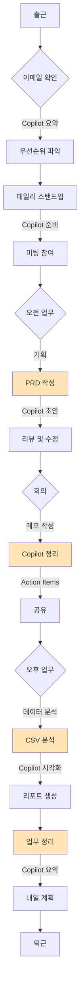

# Session 8: 나만의 Copilot 워크플로 설계
## ⏰ 소요 시간: 20분 (3:50 – 4:10)

---

## 🎯 학습 목표

이 세션을 마치면 다음을 할 수 있습니다:
- ✅ 오늘 배운 모든 기능을 하나의 워크플로로 통합
- ✅ 나만의 Copilot 활용 루틴 설계
- ✅ 업무 프로세스를 다이어그램으로 시각화
- ✅ 지속 가능한 Copilot 사용 계획 수립

---

## 📖 오늘 배운 내용 요약

### Session 0-5 핵심 요약

| 세션 | 배운 내용 | 핵심 산출물 |
|------|-----------|------------|
| 0 | 환경 세팅 | Copilot 설정 완료 |
| 1 | 회의록 정리 | Action Item 자동 추출 |
| 2 | 문서 작성 | PRD 5분 만에 생성 |
| 3 | UX 리서치 | 피드백 자동 분석 |
| 4 | 데이터 시각화 | HTML 리포트 생성 |
| 5 | 업무 자동화 | 반복 작업 스크립트 |

---

## 💪 실습 1: 나의 일일 워크플로 설계하기 (8분)

### Step 1: 새 파일 생성
파일명: `my_copilot_workflow.md`

### Step 2: Copilot Chat에 프롬프트 입력

```
나는 [직무: PO/UX/마케터]로 일하고 있어.

일반적인 하루 업무 흐름:
- 09:00: 출근, 이메일 확인
- 09:30: 팀 데일리 스탠드업 미팅
- 10:00~12:00: 기획/분석 업무
- 13:00~15:00: 회의 (주 3회)
- 15:00~17:00: 문서 작성 및 리뷰
- 17:00~18:00: 내일 준비 및 정리

오늘 배운 GitHub Copilot 기능들을 활용해서,
각 시간대별로 어떤 Copilot 기능을 사용하면 효율적일지
워크플로를 설계해줘.

다음 형식으로 작성:
1. 시간대별 추천 Copilot 활용법
2. 사용할 프롬프트 예시
3. 예상 시간 절약 효과
4. Mermaid 다이어그램으로 워크플로 시각화

Markdown 형식으로 작성해줘.
```

---

## 🎯 예상 결과물 예시

```markdown
# 나만의 GitHub Copilot 워크플로

## 👤 프로필
- **직무**: Product Owner
- **주요 업무**: 제품 기획, 요구사항 정의, 이해관계자 커뮤니케이션
- **Copilot 활용 목표**: 문서 작성 시간 50% 단축, 데이터 분석 자동화

---

## 📅 일일 워크플로

### 🌅 09:00 - 출근 & 이메일 확인 (30분)

**Copilot 활용**:
- 이메일 요약 요청
- 긴급/중요 메일 분류
- 회신 초안 작성

**프롬프트 예시**:
```
아래 이메일을 3줄로 요약하고, 
액션 아이템이 있으면 리스트로 정리해줘.
```

**시간 절약**: 20분 → 10분 (50% 단축)

---

### 📋 09:30 - 데일리 스탠드업 미팅 (30분)

**Copilot 활용**:
- 어제 작업 내용 정리
- 오늘 계획 요약
- 블로커 리스트 작성

**프롬프트 예시**:
```
아래 작업 내역을 스탠드업 미팅용으로 요약해줘:
- 어제 한 일
- 오늘 할 일
- 블로커

각 항목당 1~2줄로 간단하게.
```

**시간 절약**: 준비 시간 10분 → 2분

---

### 💡 10:00 - 기획 업무 (2시간)

**Copilot 활용**:
- PRD 초안 작성 (Session 2)
- 경쟁사 분석 표 생성
- 사용자 스토리 작성

**프롬프트 예시**:
```
[기능 아이디어]를 바탕으로 
개발팀에게 전달할 PRD를 작성해줘.
```

**시간 절약**: 2시간 → 1시간 (50% 단축)

---

### 🤝 13:00 - 회의 (2시간)

**Copilot 활용**:
- 회의 중 실시간 메모 → 회의 후 즉시 정리 (Session 1)
- Action Item 자동 추출
- 회의록 표준 형식으로 변환

**프롬프트 예시**:
```
위 회의 메모에서 Action Items를 추출하고,
담당자/마감일/우선순위를 표로 정리해줘.
```

**시간 절약**: 회의록 정리 30분 → 5분 (83% 단축)

---

### 📊 15:00 - 데이터 분석 (2시간)

**Copilot 활용**:
- 사용자 피드백 분석 (Session 3)
- CSV 데이터 시각화 (Session 4)
- 인사이트 리포트 생성

**프롬프트 예시**:
```
이 CSV 파일을 분석해서 
주요 트렌드와 인사이트를 도출하고,
시각화 리포트를 만들어줘.
```

**시간 절약**: 2시간 → 40분 (67% 단축)

---

### 🏁 17:00 - 내일 준비 (1시간)

**Copilot 활용**:
- 오늘 작업 요약
- 내일 할 일 목록 생성
- 주간 진행 상황 업데이트

**프롬프트 예시**:
```
이번 주 작업 내역을 요약하고,
다음 주 계획을 draft로 작성해줘.
```

**시간 절약**: 30분 → 10분 (67% 단축)

---

## 📊 예상 시간 절약 효과

| 업무 | 기존 시간 | Copilot 활용 후 | 절약 시간 |
|------|-----------|-----------------|----------|
| 이메일 처리 | 20분 | 10분 | ▼ 10분 |
| 미팅 준비 | 10분 | 2분 | ▼ 8분 |
| PRD 작성 | 2시간 | 1시간 | ▼ 1시간 |
| 회의록 정리 | 30분 | 5분 | ▼ 25분 |
| 데이터 분석 | 2시간 | 40분 | ▼ 1시간 20분 |
| 업무 정리 | 30분 | 10분 | ▼ 20분 |
| **합계** | **5시간 30분** | **2시간 7분** | **▼ 3시간 23분** |

**일일 생산성 향상: 61.5% 시간 절약!**

---

## 🔄 워크플로 다이어그램 (Mermaid)



---

## 📌 핵심 Copilot 프롬프트 치트시트

### 1. 문서 작성
```
[주제]에 대한 [문서 타입]을 작성해줘.
다음 구조로 작성: [섹션 나열]
```

### 2. 데이터 분석
```
이 데이터를 분석하고 주요 인사이트 3가지를 도출해줘.
표와 그래프로 시각화해줘.
```

### 3. 회의록 정리
```
위 회의록에서 Action Items를 추출하고,
담당자/마감일/우선순위를 표로 정리해줘.
```

### 4. 문체 변환
```
위 내용을 [공식적인/친근한/간결한] 톤으로 다시 작성해줘.
```

### 5. 요약
```
위 내용을 [3줄/1페이지/경영진 보고용]으로 요약해줘.
```

---

## 🎯 주간/월간 활용 계획

### 주간 루틴
- **월요일 오전**: 주간 계획 수립 (Copilot으로 템플릿 생성)
- **수요일 오후**: 중간 점검 (진행 상황 요약)
- **금요일 오후**: 주간 회고 (Copilot으로 정리)

### 월간 루틴
- **월초**: 월간 목표 설정 및 PRD 작성
- **월중**: 데이터 분석 및 리포트 생성
- **월말**: 성과 리포트 작성 및 다음 달 계획

---

## 💡 지속 가능한 Copilot 활용을 위한 팁

### 1. 템플릿화
✅ 자주 쓰는 프롬프트를 템플릿으로 저장  
✅ 팀과 공유하여 표준화  
✅ 정기적으로 업데이트

### 2. 학습 및 개선
✅ 새로운 Copilot 기능 탐색  
✅ 커뮤니티에서 베스트 프랙티스 공유  
✅ 피드백을 통한 프롬프트 개선

### 3. 측정 및 개선
✅ 시간 절약 효과 추적  
✅ 품질 향상 모니터링  
✅ ROI 계산 및 공유

---

## 🚀 다음 단계

### 내일부터 실천하기
1. ⬜ 가장 시간이 많이 걸리는 업무 1개 선택
2. ⬜ Copilot으로 자동화 시도
3. ⬜ 결과 측정 및 개선

### 1주일 후
1. ⬜ 다른 팀원에게 Copilot 활용법 공유
2. ⬜ 팀 차원의 프롬프트 라이브러리 구축
3. ⬜ 워크플로 개선 사항 반영

### 1개월 후
1. ⬜ Copilot 활용 성과 리포트 작성
2. ⬜ 경영진에게 생산성 향상 보고
3. ⬜ 전사 확산 계획 수립
```

---

## 💪 실습 2: Copilot 활용 체크리스트 만들기 (5분)

### 프롬프트

```
나의 일일/주간 업무에서 Copilot을 활용할 수 있는 
모든 시점을 체크리스트로 만들어줘.

다음 형식으로:
## 일일 체크리스트
- [ ] 작업 항목 (예상 시간 절약)

## 주간 체크리스트
- [ ] 작업 항목 (예상 시간 절약)

실제로 체크할 수 있는 구체적인 항목으로 작성해줘.
```

---

## 💪 실습 3: 팀원들과 공유할 Copilot 가이드 만들기 (7분)

### 프롬프트

```
우리 팀(PO/UX 팀)을 위한 
"GitHub Copilot 시작 가이드"를 작성해줘.

다음 내용 포함:
1. Copilot이란? (1줄 설명)
2. 왜 사용해야 하나? (혜택 3가지)
3. 가장 자주 쓰는 기능 Top 5
4. 상황별 활용 예시 (회의록, 기획서, 분석 등)
5. 자주 하는 실수와 해결 방법
6. 유용한 프롬프트 모음
7. 도움말 및 리소스

A4 2페이지 분량으로, 
비개발자가 이해하기 쉽게 작성해줘.
```

---

## 🎉 워크숍 완료!

### 축하합니다! 오늘 여러분은:

✅ GitHub Copilot을 실무에 활용할 수 있는 능력을 갖췄습니다  
✅ 6개 세션을 통해 다양한 활용 사례를 경험했습니다  
✅ 나만의 워크플로를 설계했습니다  
✅ 반복 업무를 자동화하는 방법을 배웠습니다  

---

## 📊 오늘의 성과

### 생성한 결과물
- ✅ 회의록 자동 정리 시스템
- ✅ PRD 작성 템플릿
- ✅ UX 리서치 분석 프로세스
- ✅ 데이터 시각화 리포트
- ✅ 업무 자동화 스크립트
- ✅ 개인별 워크플로 다이어그램

### 예상 효과
- ⏱️ **일일 3시간 이상 시간 절약**
- 📈 **문서 작성 속도 2배 향상**
- 🎯 **데이터 분석 시간 67% 단축**
- ✨ **반복 업무 자동화로 창의적 업무 집중**

---

## 🙋 Q&A 시간

자유롭게 질문해주세요!

### 자주 묻는 질문

**Q1: Copilot 라이선스는 어떻게 받나요?**
A: GitHub Copilot 구독 필요. 개인($10/월) 또는 기업 라이선스

**Q2: 회사 기밀 정보를 Copilot에 입력해도 되나요?**
A: GitHub Copilot Business는 데이터를 학습에 사용하지 않음. 
하지만 회사 보안 정책 확인 필수!

**Q3: 프롬프트 작성이 어려워요**
A: 
- 구체적으로 작성
- 예시 제공
- 단계별로 나누어 요청
- 피드백 반복

**Q4: Copilot이 틀린 답변을 하면?**
A: 
- 항상 검증 필요
- 수정 요청 ("위 내용을 수정해줘")
- 전문가의 최종 검토 필수

---

## 📚 추가 학습 리소스

### 공식 문서
- [GitHub Copilot Documentation](https://docs.github.com/en/copilot)
- [GitHub Copilot Best Practices](https://github.blog/developer-skills/github/how-to-write-better-prompts-for-github-copilot/)

### 커뮤니티
- GitHub Copilot Community Forum
- Stack Overflow (태그: github-copilot)

### 유튜브 채널
- GitHub 공식 채널
- Copilot 활용 튜토리얼 영상

---

## 📝 워크숍 후 액션 플랜

### 내일 (1일차)
- [ ] 오늘 배운 내용 복습
- [ ] 가장 시간이 많이 걸리는 업무 1개 선택
- [ ] Copilot으로 자동화 시도

### 이번 주 (5일차)
- [ ] 3가지 이상의 업무에 Copilot 적용
- [ ] 시간 절약 효과 측정
- [ ] 팀원 1명에게 공유

### 이번 달 (30일차)
- [ ] 팀 전체에 Copilot 활용법 공유
- [ ] 프롬프트 라이브러리 구축
- [ ] 생산성 향상 리포트 작성

---

## 🎁 보너스: Copilot 프롬프트 라이브러리

오늘 배운 모든 프롬프트를 한곳에!

파일명: `copilot_prompts_library.md`

```
GitHub Copilot 프롬프트 모음집을 만들어줘.

다음 카테고리별로 구성:
1. 문서 작성 (PRD, 회의록, 보고서)
2. 데이터 분석 (CSV, 피드백, 통계)
3. 코드 생성 (자동화, 스크립트)
4. 문체 변환 (공식/비공식, 요약/상세)
5. 시각화 (다이어그램, 차트, 표)

각 프롬프트마다:
- 프롬프트 텍스트
- 사용 상황
- 예시 결과
- 활용 팁

Markdown 형식으로 정리해줘.
```

---

## 💬 피드백 및 개선

### 오늘 워크숍에 대한 피드백을 남겨주세요!

- 가장 유용했던 세션은?
- 개선이 필요한 부분은?
- 추가로 배우고 싶은 내용은?

---

## 🎊 마무리 인사

**감사합니다!**

오늘 여러분은 GitHub Copilot을 활용하여:
- ⏱️ 시간을 절약하고
- 📈 생산성을 높이고
- ✨ 창의적인 업무에 집중할 수 있는

능력을 갖추셨습니다!

**프로젝트에서 멋진 결과물을 기대합니다!** 🚀

---

## 📞 문의 및 지원

**추가 질문**: 강사 또는 팀에 문의  
**GitHub Copilot 지원**: support@github.com

---

**이전**: [← Session 5: 업무 자동화](session5_automation.md)  
**홈으로**: [커리큘럼 보기](../context/curriculum_v2.md)
